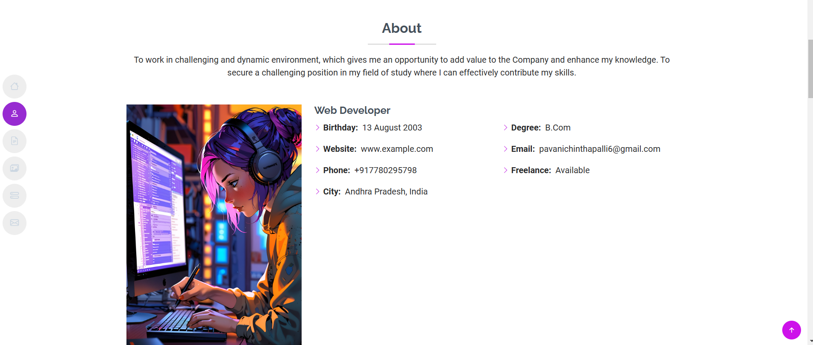

# Portfolio Project

## Overview


The Portfolio Project is a personal website designed to showcase my skills, projects, and experiences. It serves as a central hub for potential employers, collaborators, or clients to learn more about me and my work. The portfolio is built with modern web development technologies, ensuring a sleek, responsive, and user-friendly interface.

## Features
- **About Me Section**: Highlights my background, skills, and interests.
- **Projects Showcase**: Displays my completed and ongoing projects with descriptions, technologies used, and links to live demos or repositories.
- **Skills and Tools**: Lists technical skills and tools I am proficient in, presented visually for clarity.
- **Contact Form**: Allows visitors to reach out via a built-in form that forwards messages to my email.
- **Responsive Design**: Optimized for viewing on desktops, tablets, and mobile devices.
- **Dynamic Animations**: Includes smooth animations and transitions for an engaging user experience.

## Technologies Used
- **Frontend**: HTML, CSS, JavaScript, TailwindCSS
- **Libraries**: 
  - [AOS.js](https://michalsnik.github.io/aos/) for scroll animations.
  - [Swiper.js](https://swiperjs.com/) for project carousels.
- **Deployment**: Hosted on [GitHub Pages](https://pages.github.com/) or [Vercel](https://vercel.com/).
- **Additional Tools**: 
  - Webpack or Vite for bundling.
  - Figma for designing the UI/UX.

## Installation
1. Clone the repository:
   ```bash
   git clone https://github.com/yourusername/portfolio.git
