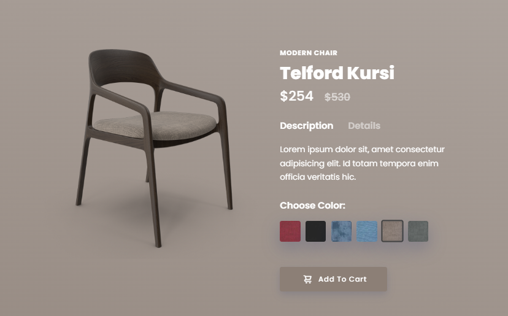

# Modern Chair Project

## Overview


The Modern Chair Project is a web-based showcase designed to display various designs of modern chairs. It highlights ergonomic, aesthetic, and functional chair models for home and office use. The application offers a sleek interface to explore designs and provides users with detailed descriptions and specifications of each chair model.

## Features
- **Chair Catalog**: Browse through a curated collection of modern chair designs.
- **Detailed Specifications**: View information about dimensions, materials, and pricing.
- **Responsive Layout**: Optimized for desktops, tablets, and mobile devices.
- **Interactive Views**: Rotate and zoom in on 3D models for a closer look.
- **Favorites and Comparisons**: Save favorite designs and compare features.
- **Dark Mode Support**: Switch between light and dark themes for better user experience.

## Technologies Used
- **Frontend**: HTML, CSS, JavaScript, TailwindCSS
- **Backend**: Node.js or Firebase (optional for data storage)
- **Libraries**: 
  - [Three.js](https://threejs.org/) for 3D visualization.
  - [Swiper.js](https://swiperjs.com/) for creating responsive carousels.
- **Additional Tools**: 
  - Webpack or Vite for bundling assets.
  - Prettier and ESLint for code quality.

## Installation
1. Clone the repository:
   ```bash
   git clone https://github.com/yourusername/modern-chair.git
