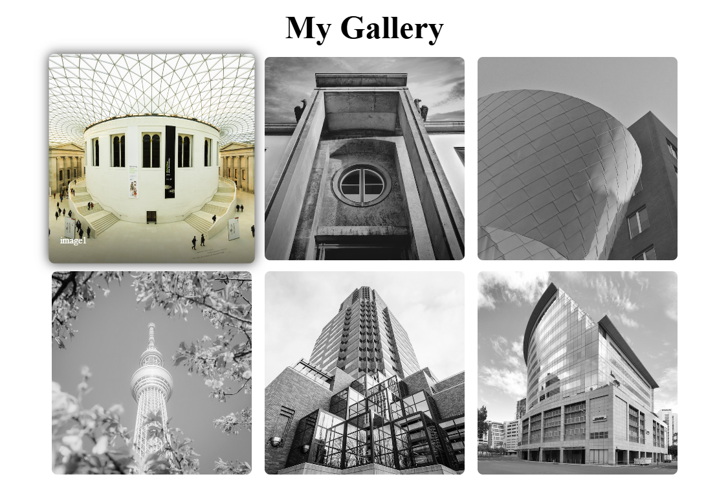

# Image Gallery Project

## Overview

## Overview


The Image Gallery Project is a web-based application designed to showcase images in a visually appealing and user-friendly manner. It allows users to view, filter, and interact with a collection of images. The gallery is built using modern web development technologies and is optimized for performance and responsiveness.

## Features
- **Dynamic Image Display**: Images are loaded dynamically for smooth performance.
- **Responsive Design**: Works seamlessly on desktops, tablets, and mobile devices.
- **Filter and Search**: Users can search or filter images based on categories or tags.
- **Lightbox View**: Click on an image to view it in a full-screen lightbox with navigation controls.
- **Lazy Loading**: Images are loaded only when they are in the viewport to improve performance.
- **Customizable Themes**: Change the gallery's appearance with predefined themes or custom styles.

## Technologies Used
- **Frontend**: HTML, CSS, JavaScript, TailwindCSS
- **Backend**: Node.js (optional, if server functionality is required)
- **Libraries**: 
  - [Lightbox.js](https://lokeshdhakar.com/projects/lightbox2/) for image previews.
  - [Masonry.js](https://masonry.desandro.com/) for dynamic grid layouts.
- **Additional Tools**: 
  - Webpack or Vite for module bundling (if applicable).
  - Prettier and ESLint for code formatting and linting.

## Installation
1. Clone the repository:
   ```bash
   git clone https://github.com/yourusername/image-gallery.git
